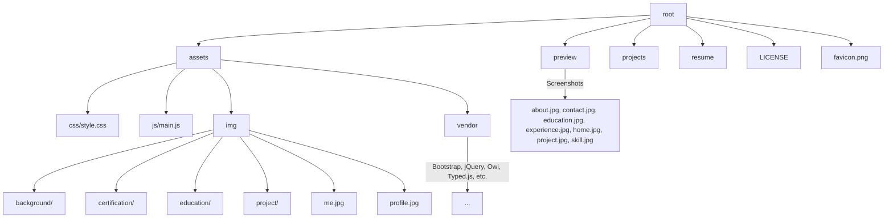
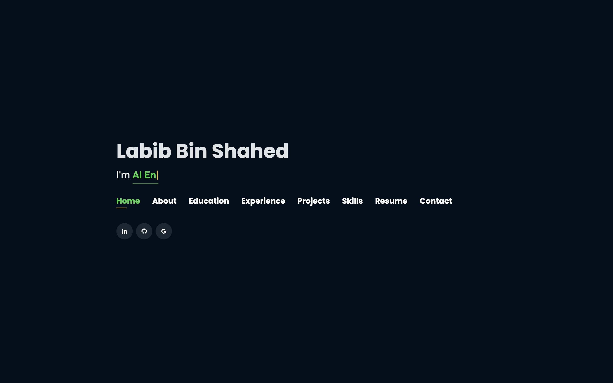
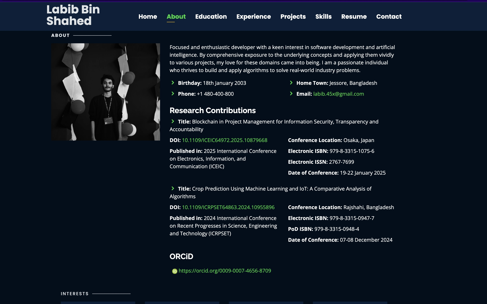
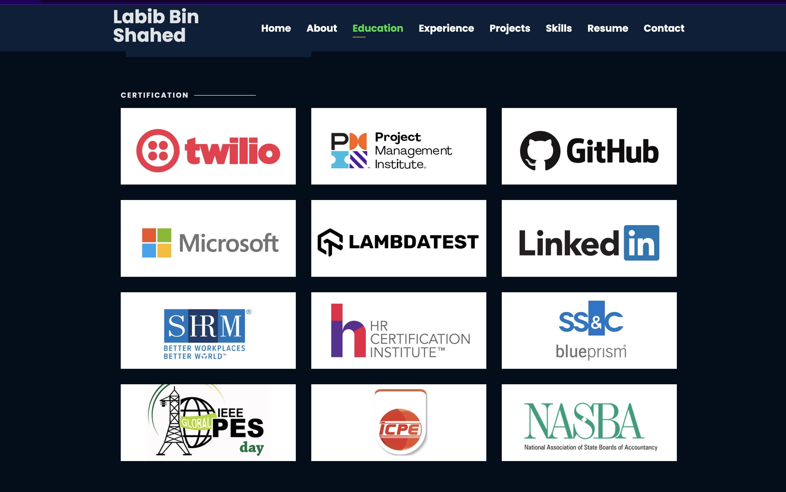
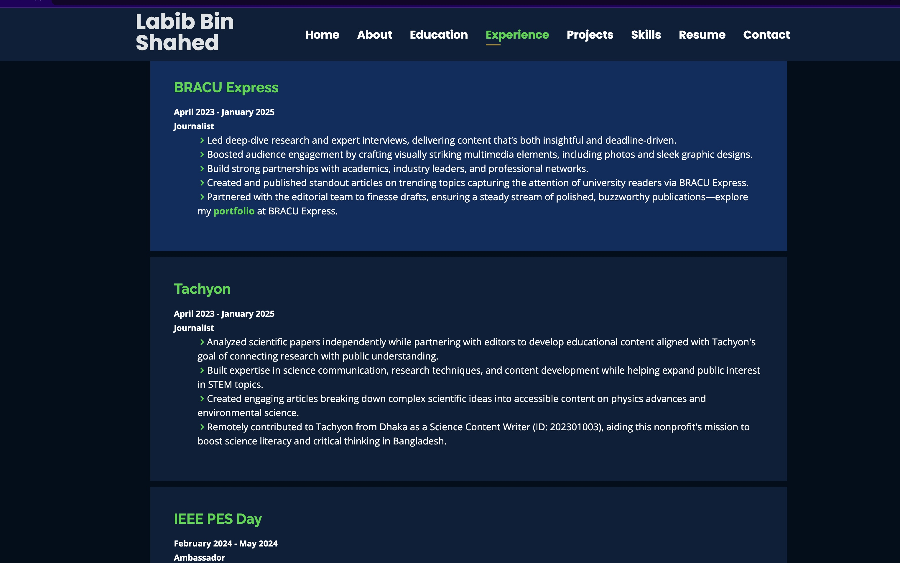
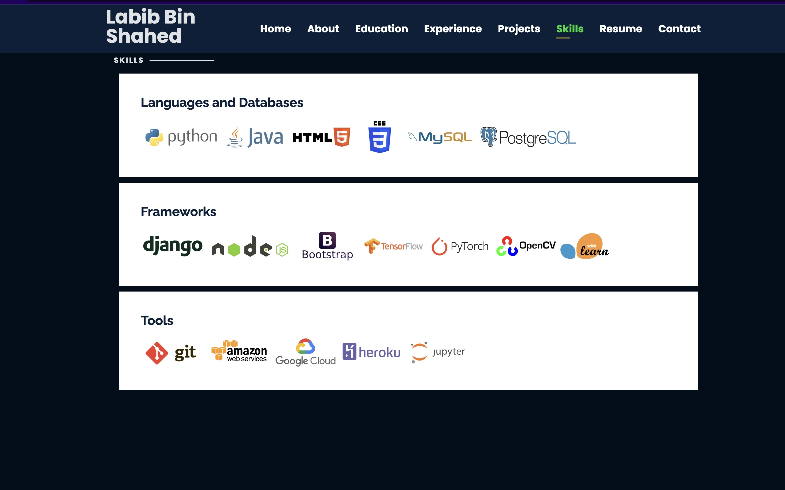
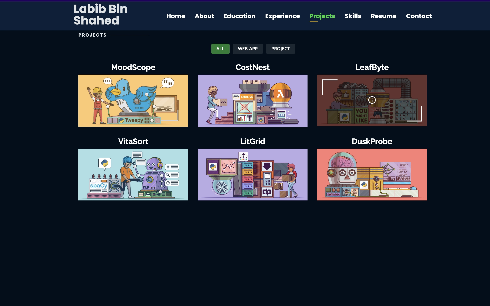
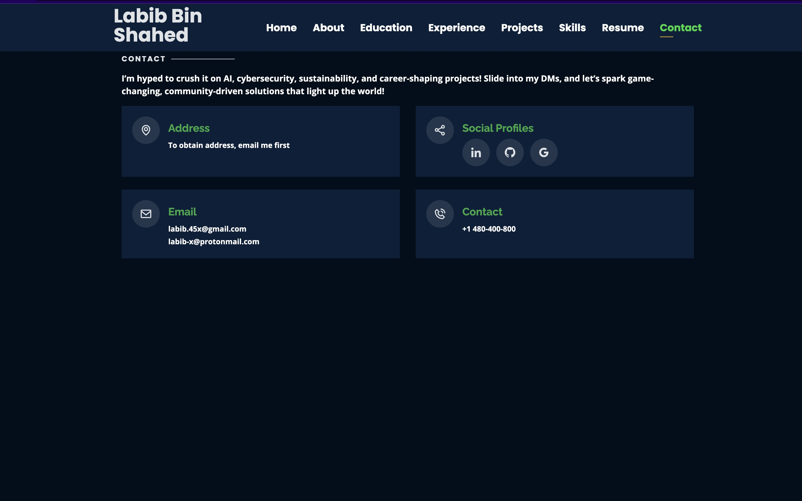

# AURIX

A modern, responsive, and developer-centric personal portfolio website built using HTML5, CSS3, JavaScript, and a variety of frontend libraries. The site showcases personal information, education, work experience, skills, and projects, all optimized for performance, interactivity, and accessibility.
- Live Demo: [https://la-b-ib.github.io](https://la-b-ib.github.io)  

---

## Features

- Responsive design using Bootstrap
- Animated typing effect with Typed.js
- Image galleries with Venobox
- Scroll-triggered counters and animations
- Project filtering with Isotope
- Integrated contact form (PHP-based)
- Organized file structure for scalability
- GitHub Actions for automated deployment

---

## Website Preview (All Device)

<p align="left">
  
<p align="left">

<p align="left">
  
   

<p align="left">

<hr>

## Mobileview Preview
<p align="left">
  
   
    
     
</p>

<hr>
<p align="left">
  
   
    
     
</p>
<hr>

## Technologies & Libraries

- HTML5, CSS3, JavaScript
- Bootstrap 4+
- jQuery & jQuery plugins
- Owl Carousel
- Typed.js
- Venobox
- Isotope Layout
- Font libraries: Boxicons, Icofont, Remixicon

---

## Folder Structure



---

## Preview

| Home | About | Education | Experience |
|------|-------|-----------|------------|
|  |  |  |  |

| Skills | Projects | Contact |
|--------|----------|---------|
|  |  |  |

---

## Setup Instructions

1. **Clone the repository**
   ```bash
   git clone https://github.com/la-b-ib/la-b-ib.github.io.git
   cd la-b-ib.github.io
   ```

2. **Open `index.html` in a browser**
   You can use Live Server if you're using VS Code:
   ```
   Right-click on index.html → "Open with Live Server"
   ```

3. **Customize your content**
   - Update images in `assets/img`
   - Modify `assets/css/style.css` for theme changes
   - Update text in HTML sections

---

## GitHub Actions – Deployment Workflow

A GitHub Actions workflow has been added to automate deployment (for example, to GitHub Pages or any static host).

### `.github/workflows/deploy.yml`
```yaml
name: Deploy Portfolio

on:
  push:
    branches:
      - main

jobs:
  deploy:
    runs-on: ubuntu-latest
    steps:
      - name: Checkout Code
        uses: actions/checkout@v3

      - name: Deploy to GitHub Pages
        uses: peaceiris/actions-gh-pages@v3
        with:
          github_token: ${{ secrets.GITHUB_TOKEN }}
          publish_dir: ./ # or specify the build/output directory
```

Make sure to update the `publish_dir` to the folder you want to serve (typically root for static portfolios).

---

## Performance Optimization

- **Image Optimization:** Use compressed `.jpg` images in `assets/img` and lazy loading techniques to enhance load times.
- **Minification:** CSS and JS files can be minified using tools like `uglify-js` or `cssnano` before deployment.
- **Caching:** Add headers for caching static resources on deployment (e.g., via `.htaccess` or hosting provider settings).
- **CDN Usage:** External libraries (e.g., Bootstrap, jQuery) can be optionally loaded from a CDN to reduce initial bundle size.

---

## SEO and Accessibility

- **Meta Tags:** Includes descriptive meta tags for improved search engine indexing.
- **Semantic HTML:** Uses semantic elements like `<header>`, `<section>`, `<footer>` for better accessibility.
- **Alt Attributes:** All images support `alt` attributes for screen readers.
- **Keyboard Navigation:** Interactive elements are accessible via keyboard (focusable and tabbable).

---

## Development Tips

- Use **Live Server** in VS Code for live reloading while editing HTML/CSS/JS.
- Maintain modular JS structure by separating components in `assets/js/`.
- Prefer **rem/em** units over **px** for responsive design consistency.
- Leverage browser dev tools for performance profiling and debugging.

---

## Deployment Recommendations

- **GitHub Pages:** Free hosting for static sites; just push to `gh-pages` branch or configure `deploy.yml`.
- **Netlify or Vercel:** CI/CD deployment with custom domains, HTTPS, and build previews.
- **FTP Deployment:** Manual option for hosting on traditional web servers via cPanel, FileZilla, etc.

---

## Contact Integration Notes

- Contact form uses `php-email-form` and requires server-side PHP support.
- Configure `assets/vendor/php-email-form/validate.js` and backend PHP script for email routing.
- For hosted services like Netlify Forms or Formspree, replace the form action URL accordingly.

---

## Future Enhancements (Suggestions)

- Add dark mode toggle using CSS variables and localStorage.
- Integrate a blog section using markdown + static site generator (e.g., Eleventy).
- Add animation triggers using IntersectionObserver for better performance.
- Convert to PWA for offline access and mobile-friendly installability.


## Contributing Guidelines

We welcome contributions of all kinds! To maintain a high-quality codebase, please follow these guidelines:

### How to Contribute

1. **Fork the Repository**
   - Click the "Fork" button at the top right of this page.

2. **Clone your Fork**
   ```bash
   git clone https://github.com/your-username/la-b-ib.github.io.git
   cd la-b-ib.github.io
   ```

3. **Create a Feature Branch**
   ```bash
   git checkout -b feature/your-feature-name
   ```

4. **Make Your Changes**
   - Follow the code style used in the project.
   - Update or add documentation/comments as needed.

5. **Commit and Push**
   ```bash
   git add .
   git commit -m "Add: brief description of your feature"
   git push origin feature/your-feature-name
   ```

6. **Open a Pull Request**
   - Go to your fork on GitHub and click "Compare & pull request".
   - Describe your changes thoroughly.

### Contribution Checklist

- [ ] Code follows the project's style guidelines
- [ ] Commit messages are clear and meaningful
- [ ] All new and existing tests pass (if applicable)
- [ ] I have added documentation where necessary

---

## Code Quality & Linting

- Use [ESLint](https://eslint.org/) for maintaining consistent JavaScript syntax and style.
- Recommended configuration can be added in a `.eslintrc.json` file.
- Consider using [Prettier](https://prettier.io/) for automatic code formatting.

**Example ESLint Rule Snippet:**
```json
{
  "env": {
    "browser": true,
    "es2021": true
  },
  "extends": "eslint:recommended",
  "rules": {
    "indent": ["error", 2],
    "quotes": ["error", "single"],
    "semi": ["error", "always"]
  }
}
```

---

## Analytics Integration

- Integrate [Google Analytics](https://analytics.google.com/) or [Plausible](https://plausible.io/) to track visitor data.
- Add your tracking script inside `<head>` or just before `</body>` in `index.html`.

**Example:**
```html
<!-- Google Analytics Example -->
<script async src="https://www.googletagmanager.com/gtag/js?id=UA-XXXXXXXXX-X"></script>
<script>
  window.dataLayer = window.dataLayer || [];
  function gtag(){dataLayer.push(arguments);}
  gtag('js', new Date());
  gtag('config', 'UA-XXXXXXXXX-X');
</script>
```

## Project Documentation

<div style="display: flex; gap: 10px; margin: 15px 0; align-items: center; flex-wrap: wrap;">

[](LICENSE)
[](SECURITY.md)
[](CONTRIBUTING.md)
[](CODE_OF_CONDUCT.md)

</div>

## Contact Information


  
[](mailto:labib.45x@gmail.com)
[](https://github.com/la-b-ib)
[](https://www.linkedin.com/in/la-b-ib/)
[](https://la-b-ib.github.io/)
[](https://x.com/la_b_ib_)


---

