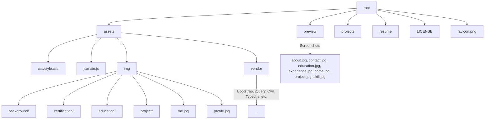

# 💼 Personal Portfolio Website


A modern, responsive, and developer-centric personal portfolio website built using HTML5, CSS3, JavaScript, and a variety of frontend libraries. The site showcases personal information, education, work experience, skills, and projects, all optimized for performance, interactivity, and accessibility.

---

## 🚀 Features

- Responsive design using Bootstrap
- Animated typing effect with Typed.js
- Image galleries with Venobox
- Scroll-triggered counters and animations
- Project filtering with Isotope
- Integrated contact form (PHP-based)
- Organized file structure for scalability
- GitHub Actions for automated deployment

---

## 🔧 Technologies & Libraries

- HTML5, CSS3, JavaScript
- Bootstrap 4+
- jQuery & jQuery plugins
- Owl Carousel
- Typed.js
- Venobox
- Isotope Layout
- Font libraries: Boxicons, Icofont, Remixicon

---

## 📂 Folder Structure



---

## 🖼️ Preview

| Home | About | Education | Experience |
|------|-------|-----------|------------|
|  |  |  |  |

| Skills | Projects | Contact |
|--------|----------|---------|
|  |  |  |

---

## ⚙️ Setup Instructions

1. **Clone the repository**
   ```bash
   git clone https://github.com/la-b-ib/your-repo-name.git
   cd your-repo-name
   ```

2. **Open `index.html` in a browser**
   You can use Live Server if you're using VS Code:
   ```
   Right-click on index.html → "Open with Live Server"
   ```

3. **Customize your content**
   - Update images in `assets/img`
   - Modify `assets/css/style.css` for theme changes
   - Update text in HTML sections

---

## 🧪 GitHub Actions – Deployment Workflow

A GitHub Actions workflow has been added to automate deployment (for example, to GitHub Pages or any static host).

### `.github/workflows/deploy.yml`
```yaml
name: Deploy Portfolio

on:
  push:
    branches:
      - main

jobs:
  deploy:
    runs-on: ubuntu-latest
    steps:
      - name: Checkout Code
        uses: actions/checkout@v3

      - name: Deploy to GitHub Pages
        uses: peaceiris/actions-gh-pages@v3
        with:
          github_token: ${{ secrets.GITHUB_TOKEN }}
          publish_dir: ./ # or specify the build/output directory
```

Make sure to update the `publish_dir` to the folder you want to serve (typically root for static portfolios).

---

## 🔒 License

This project is licensed under the terms of the MIT license. See the [LICENSE](LICENSE) file for details.

---

## 👤 Author

**la-b-ib**  
🔗 GitHub: [https://github.com/la-b-ib](https://github.com/la-b-ib)
