#  Portfolio Website

A modern, responsive, and developer-centric personal portfolio website built using HTML5, CSS3, JavaScript, and a variety of frontend libraries. The site showcases personal information, education, work experience, skills, projects, and certifications, all optimized for performance, interactivity, and accessibility.
<hr>

##  Features

- **Responsive Design**: Fully responsive layout that works on desktop, tablet, and mobile devices
- **Modern UI/UX**: Clean, professional design with glassmorphism effects
- **Interactive Portfolio**: Project and certification galleries with hover effects
- **Single Page Application**: Smooth section navigation with JavaScript
- **Mobile Optimized**: Touch-friendly interface with proper tap targets
- **Performance Optimized**: Hardware acceleration, optimized assets, and smooth animations
- **Accessibility**: Proper ARIA labels, alt text, and keyboard navigation
- **Cross-Browser Compatible**: Works on all modern browsers including Safari, Chrome, Firefox, Edge

<hr>

## Design Highlights

- **Glassmorphism UI**: Modern frosted glass effects with backdrop filters
- **Custom Typography**: Bungee font family for unique branding
- **Material Icons**: Google Material Icons for consistent iconography  
- **Smooth Animations**: CSS transitions and transforms for enhanced UX

<hr>

## Mobile Features

- **Touch Optimized**: 44px minimum touch targets following accessibility guidelines
- **Mobile Navigation**: Collapsible hamburger menu with Material Icons
- **Swipe Gestures**: Touch-friendly interactions
- **Mobile-First CSS**: Responsive breakpoints and mobile-specific optimizations
- **iOS/Safari Compatibility**: Webkit prefixes and iOS-specific fixes

---

## Website Preview 
<p align="left">
  
<p align="left">

<p align="left">
  
   
<p align="left">

<hr>


## Tech Stack

### Frontend
- **HTML5**: Semantic markup with proper structure
- **CSS3**: Modern CSS with Flexbox, Grid, and advanced features
- **JavaScript (jQuery)**: Interactive functionality and smooth animations
- **Material Icons**: Google's Material Design icon system

<hr>

### Libraries & CDN
- **Bootstrap 5.3.7**: Responsive grid system and components
- **jQuery 3.7.1**: DOM manipulation and event handling
- **Remixicon 4.6.0**: Additional icon set
- **Boxicons 2.1.0**: Icon library for UI elements
- **VenoBox 2.1.8**: Lightbox for image galleries

<hr>

### Performance
- **CDN Delivery**: Fast loading via CloudFlare CDN
- **Lazy Loading**: Optimized image loading
- **Hardware Acceleration**: GPU-accelerated animations
- **Prefetch**: Critical resource preloading

<hr>

##  File Structure

```mermaid
graph LR
    A[🏠 Root Directory] --> B[📄 index.html]
    A --> C[📁 assets/]
    A --> D[📄 README.md]
    A --> E[📄 LICENSE]
    A --> F[📄 CNAME]
    A --> G[📄 SECURITY.md]
    A --> H[📄 CONTRIBUTING.md]
    A --> I[📄 CODE_OF_CONDUCT.md]
    A --> J[📁 preview/]
    

    C --> L[📁 backend/]
    C --> M[📁 GIF/]
    C --> N[📁 img/]
    
    L --> O[📁 css/]
    L --> P[📁 javascript/]
    
    O --> Q[📄 style.css]
    P --> R[📄 main.js]
    
    M --> S[📄 BLOG.GIF]
    M --> T[📄 edu.GIF]
    M --> U[📄 experience.gif]
    M --> V[📄 skills.GIF]
    M --> W[📄 stats.gif]
    M --> X[📁 contact/]
    
    N --> Y[📁 blogs/]
    N --> Z[📁 certification/]
    N --> AA[📁 dev badge/]
    N --> BB[📁 education/]
    N --> CC[📁 experience/]
    N --> DD[📁 favicon/]
    N --> EE[📁 profile/]
    N --> FF[📁 project/]
    N --> GG[📁 qr code/]
    N --> HH[📁 recommendation/]
    N --> II[📁 research/]
    N --> JJ[📁 research badge/]
    N --> KK[📁 share preview/]
    N --> LL[📁 social links icon/]
    
    Z --> MM[📄 chain.png]
    Z --> NN[📄 tw.jpg]
    Z --> OO[📄 pmi.jpg]
    Z --> PP[📄 gh.jpg]
    Z --> QQ[📄 ms.jpg]
    Z --> RR[📄 li.jpg]
    Z --> SS[📄 hr.jpg]
    Z --> TT[📄 ... more certs]
    
    FF --> UU[📄 MoodScope.jpg]
    FF --> VV[📄 CostNest.jpeg]
    FF --> WW[📄 LeafByte.jpg]
    FF --> XX[📄 VitaSort.jpg]
    FF --> YY[📄 LitGrid.jpg]
    FF --> ZZ[📄 DuskProbe.jpg]
    
    J --> AAA[📁 gif/]
    J --> BBB[📁 img/]
    
    AAA --> CCC[📄 web-developer.gif]
    AAA --> DDD[📄 website.gif]
    
    BBB --> EEE[📁 all device view/]
    BBB --> FFF[📁 mobileview/]

    style A fill:#e1f5fe
    style B fill:#fff3e0
    style C fill:#f3e5f5
    style Q fill:#e8f5e8
    style R fill:#e8f5e8
    style MM fill:#ffebee
    style K fill:#fff9c4
```


<hr>


##  Architecture Overview

### Core Components

1. **Header Section** (`#header`)
   - Personal branding and navigation
   - Social media links
   - Responsive design with mobile hamburger menu

2. **About Section** (`#about`)
   - Personal introduction and bio
   - Professional highlights
   - Interactive elements

3. **Education Section** (`#education`)
   - Academic background
   - Course details with tooltips
   - Interactive course listings

4. **Certification Section** (`#certification`)
   - Professional certifications
   - LinkedIn Learning certificates
   - Clickable chain.png icons for verification links

5. **Research Section** (`#research`)
   - Published papers and research work
   - Academic contributions
   - Research badges and achievements

6. **Experience Section** (`#experience`)
   - Work history and roles
   - Professional achievements
   - Timeline-based layout

7. **Projects Section** (`#portfolio`)
   - Showcase of development projects
   - GitHub repository links
   - Interactive project cards with hover effects

8. **Skills Section** (`#skills`)
   - Technical skills and competencies
   - Programming languages
   - Tools and frameworks
   - Visual skill representations

9. **Contact Section** (`#contact`)
   - Contact information
   - Social media integration
   - Contact form (if implemented)


<hr>


## Navigation System


<hr>

## 📋 Section Details

### Projects Portfolio
- **MoodScope**: Sentiment analysis application (Jan 24 - Apr 24)
- **CostNest**: Purchase tracking system (May 23 - Aug 23)  
- **LeafByte**: Carbon footprint calculator (Sep 23 - Dec 23)
- **VitaSort**: Career matching platform (Jun 23 - Sep 23)
- **LitGrid**: Cloud library management (Mar 23 - Jun 23)
- **DuskProbe**: Vulnerability detection tool (Nov 23 - Apr 24)

### Certification Portfolio
- Professional certifications from LinkedIn Learning
- Microsoft, Google, IBM certifications
- Cybersecurity and development certificates
- Project management credentials

## 🛠️ Technical Implementation

### CSS Architecture
- **Mobile-First Design**: Responsive breakpoints starting from mobile
- **CSS Grid & Flexbox**: Modern layout techniques
- **Custom Properties**: CSS variables for consistency
- **Performance Optimization**: Hardware acceleration and efficient selectors

### JavaScript Functionality
- **jQuery-based**: DOM manipulation and event handling
- **Mobile Touch Support**: Touch events and gesture handling
- **Smooth Navigation**: Section-based single-page navigation
- **Interactive Elements**: Hover effects and click handlers

## Setup Instructions

1. **Clone the repository**
   ```bash
   git clone https://github.com/la-b-ib/la-b-ib.github.io.git
   cd la-b-ib.github.io
   ```

2. **Open `index.html` in a browser**
   You can use Live Server if you're using VS Code:
   ```
   Right-click on index.html → "Open with Live Server"
   ```

3. **Customize your content**
   - Update images in `assets/img`
   - Modify `assets/css/style.css` for theme changes
   - Update text in HTML sections

---

## GitHub Actions – Deployment Workflow

A GitHub Actions workflow has been added to automate deployment (for example, to GitHub Pages or any static host).

### `.github/workflows/deploy.yml`
```yaml
name: Deploy Portfolio

on:
  push:
    branches:
      - main

jobs:
  deploy:
    runs-on: ubuntu-latest
    steps:
      - name: Checkout Code
        uses: actions/checkout@v3

      - name: Deploy to GitHub Pages
        uses: peaceiris/actions-gh-pages@v3
        with:
          github_token: ${{ secrets.GITHUB_TOKEN }}
          publish_dir: ./ # or specify the build/output directory
```

Make sure to update the `publish_dir` to the folder you want to serve (typically root for static portfolios).

---

## Performance Optimization

- **Image Optimization:** Use compressed `.jpg` images in `assets/img` and lazy loading techniques to enhance load times.
- **Minification:** CSS and JS files can be minified using tools like `uglify-js` or `cssnano` before deployment.
- **Caching:** Add headers for caching static resources on deployment (e.g., via `.htaccess` or hosting provider settings).
- **CDN Usage:** External libraries (e.g., Bootstrap, jQuery) can be optionally loaded from a CDN to reduce initial bundle size.

---

## SEO and Accessibility

- **Meta Tags:** Includes descriptive meta tags for improved search engine indexing.
- **Semantic HTML:** Uses semantic elements like `<header>`, `<section>`, `<footer>` for better accessibility.
- **Alt Attributes:** All images support `alt` attributes for screen readers.
- **Keyboard Navigation:** Interactive elements are accessible via keyboard (focusable and tabbable).

---

## Development Tips

- Use **Live Server** in VS Code for live reloading while editing HTML/CSS/JS.
- Maintain modular JS structure by separating components in `assets/js/`.
- Prefer **rem/em** units over **px** for responsive design consistency.
- Leverage browser dev tools for performance profiling and debugging.

---

## Deployment Recommendations

- **GitHub Pages:** Free hosting for static sites; just push to `gh-pages` branch or configure `deploy.yml`.
- **Netlify or Vercel:** CI/CD deployment with custom domains, HTTPS, and build previews.
- **FTP Deployment:** Manual option for hosting on traditional web servers via cPanel, FileZilla, etc.

---

## Contact Integration Notes

- Contact form uses `php-email-form` and requires server-side PHP support.
- Configure `assets/vendor/php-email-form/validate.js` and backend PHP script for email routing.
- For hosted services like Netlify Forms or Formspree, replace the form action URL accordingly.

---

## Future Enhancements (Suggestions)

- Add dark mode toggle using CSS variables and localStorage.
- Integrate a blog section using markdown + static site generator (e.g., Eleventy).
- Add animation triggers using IntersectionObserver for better performance.
- Convert to PWA for offline access and mobile-friendly installability.


## Contributing Guidelines

We welcome contributions of all kinds! To maintain a high-quality codebase, please follow these guidelines:

### How to Contribute

1. **Fork the Repository**
   - Click the "Fork" button at the top right of this page.

2. **Clone your Fork**
   ```bash
   git clone https://github.com/your-username/la-b-ib.github.io.git
   cd la-b-ib.github.io
   ```

3. **Create a Feature Branch**
   ```bash
   git checkout -b feature/your-feature-name
   ```

4. **Make Your Changes**
   - Follow the code style used in the project.
   - Update or add documentation/comments as needed.

5. **Commit and Push**
   ```bash
   git add .
   git commit -m "Add: brief description of your feature"
   git push origin feature/your-feature-name
   ```

6. **Open a Pull Request**
   - Go to your fork on GitHub and click "Compare & pull request".
   - Describe your changes thoroughly.

### Contribution Checklist

- [ ] Code follows the project's style guidelines
- [ ] Commit messages are clear and meaningful
- [ ] All new and existing tests pass (if applicable)
- [ ] I have added documentation where necessary

---

## Code Quality & Linting

- Use [ESLint](https://eslint.org/) for maintaining consistent JavaScript syntax and style.
- Recommended configuration can be added in a `.eslintrc.json` file.
- Consider using [Prettier](https://prettier.io/) for automatic code formatting.

**Example ESLint Rule Snippet:**
```json
{
  "env": {
    "browser": true,
    "es2021": true
  },
  "extends": "eslint:recommended",
  "rules": {
    "indent": ["error", 2],
    "quotes": ["error", "single"],
    "semi": ["error", "always"]
  }
}
```

---

## Analytics Integration

- Integrate [Google Analytics](https://analytics.google.com/) or [Plausible](https://plausible.io/) to track visitor data.
- Add your tracking script inside `<head>` or just before `</body>` in `index.html`.

**Example:**
```html
<!-- Google Analytics Example -->
<script async src="https://www.googletagmanager.com/gtag/js?id=UA-XXXXXXXXX-X"></script>
<script>
  window.dataLayer = window.dataLayer || [];
  function gtag(){dataLayer.push(arguments);}
  gtag('js', new Date());
  gtag('config', 'UA-XXXXXXXXX-X');
</script>
```

## 🎯 Key Features Implementation

### Chain.png Link Functionality
- **Desktop & Mobile Support**: Proper click/touch handling
- **Z-index Management**: Ensures links are accessible
- **Touch Targets**: 44px minimum for accessibility
- **Visual Feedback**: Tap highlighting on mobile

### Glassmorphism Effects
- **Backdrop Filters**: Modern blur effects
- **Transparency**: RGBA colors with opacity
- **Browser Fallbacks**: Support for older browsers

### Performance Optimizations
- **Hardware Acceleration**: \`transform: translateZ(0)\`
- **Will-Change**: Optimized for animations
- **Preloading**: Critical resources preloaded
- **CDN Delivery**: Fast asset loading

## 📊 Performance Metrics

- **First Contentful Paint**: < 2.5s
- **Largest Contentful Paint**: < 4.0s
- **Cumulative Layout Shift**: < 0.1
- **Mobile Performance Score**: 90+
- **Desktop Performance Score**: 95+

## 🔒 Security Features

- **Content Security Policy**: XSS protection
- **Referrer Policy**: Privacy protection
- **Transport Security**: HTTPS enforcement
- **Permissions Policy**: Limited API access


## Project Documentation

<div style="display: flex; gap: 10px; margin: 15px 0; align-items: center; flex-wrap: wrap;">

[](LICENSE)
[](SECURITY.md)
[](CONTRIBUTING.md)
[](CODE_OF_CONDUCT.md)

</div>

## Contact Information


  
[](mailto:labib.45x@gmail.com)
[](https://github.com/la-b-ib)
[](https://www.linkedin.com/in/la-b-ib/)
[](https://la-b-ib.github.io/)
[](https://x.com/la_b_ib_)


---

