## 🚀 Tech Stack

### Frontend
- **HTML5**: Semantic markup with proper structure
- **CSS3**: Modern CSS with Flexbox, Grid, and advanced features
- **JavaScript (jQuery)**: Interactive functionality and smooth animations
- **Material Icons**: Google's Material Design icon system

### Libraries & CDN
- **Bootstrap 5.3.7**: Responsive grid system and components
- **jQuery 3.7.1**: DOM manipulation and event handling
- **Remixicon 4.6.0**: Additional icon set
- **Boxicons 2.1.0**: Icon library for UI elements
- **VenoBox 2.1.8**: Lightbox for image galleries

### Performance
- **CDN Delivery**: Fast loading via CloudFlare CDN
- **Lazy Loading**: Optimized image loading
- **Hardware Acceleration**: GPU-accelerated animations
- **Prefetch**: Critical resource preloading

## 📂 File Structure

```mermaid
graph TD
    A[🏠 Root Directory] --> B[📄 index.html]
    A --> C[📁 assets/]
    A --> D[📄 README.md]
    A --> E[📄 LICENSE]
    A --> F[📄 CNAME]
    A --> G[📄 SECURITY.md]
    A --> H[📄 CONTRIBUTING.md]
    A --> I[📄 CODE_OF_CONDUCT.md]
    A --> J[📁 preview/]
    A --> K[📄 lolypop.md]

    C --> L[📁 backend/]
    C --> M[📁 GIF/]
    C --> N[📁 img/]
    
    L --> O[📁 css/]
    L --> P[📁 javascript/]
    
    O --> Q[📄 style.css]
    P --> R[📄 main.js]
    
    M --> S[📄 BLOG.GIF]
    M --> T[📄 edu.GIF]
    M --> U[📄 experience.gif]
    M --> V[📄 skills.GIF]
    M --> W[📄 stats.gif]
    M --> X[📁 contact/]
    
    N --> Y[📁 blogs/]
    N --> Z[📁 certification/]
    N --> AA[📁 dev badge/]
    N --> BB[📁 education/]
    N --> CC[📁 experience/]
    N --> DD[📁 favicon/]
    N --> EE[📁 profile/]
    N --> FF[📁 project/]
    N --> GG[📁 qr code/]
    N --> HH[📁 recommendation/]
    N --> II[📁 research/]
    N --> JJ[📁 research badge/]
    N --> KK[📁 share preview/]
    N --> LL[📁 social links icon/]
    
    Z --> MM[📄 chain.png]
    Z --> NN[📄 tw.jpg]
    Z --> OO[📄 pmi.jpg]
    Z --> PP[📄 gh.jpg]
    Z --> QQ[📄 ms.jpg]
    Z --> RR[📄 li.jpg]
    Z --> SS[📄 hr.jpg]
    Z --> TT[📄 ... more certs]
    
    FF --> UU[📄 MoodScope.jpg]
    FF --> VV[📄 CostNest.jpeg]
    FF --> WW[📄 LeafByte.jpg]
    FF --> XX[📄 VitaSort.jpg]
    FF --> YY[📄 LitGrid.jpg]
    FF --> ZZ[📄 DuskProbe.jpg]
    
    J --> AAA[📁 gif/]
    J --> BBB[📁 img/]
    
    AAA --> CCC[📄 web-developer.gif]
    AAA --> DDD[📄 website.gif]
    
    BBB --> EEE[📁 all device view/]
    BBB --> FFF[📁 mobileview/]

    style A fill:#e1f5fe
    style B fill:#fff3e0
    style C fill:#f3e5f5
    style Q fill:#e8f5e8
    style R fill:#e8f5e8
    style MM fill:#ffebee
    style K fill:#fff9c4
```

## 🏗️ Architecture Overview

### Core Components

1. **Header Section** (`#header`)
   - Personal branding and navigation
   - Social media links
   - Responsive design with mobile hamburger menu

2. **About Section** (`#about`)
   - Personal introduction and bio
   - Professional highlights
   - Interactive elements

3. **Education Section** (`#education`)
   - Academic background
   - Course details with tooltips
   - Interactive course listings

4. **Certification Section** (`#certification`)
   - Professional certifications
   - LinkedIn Learning certificates
   - Clickable chain.png icons for verification links

5. **Research Section** (`#research`)
   - Published papers and research work
   - Academic contributions
   - Research badges and achievements

6. **Experience Section** (`#experience`)
   - Work history and roles
   - Professional achievements
   - Timeline-based layout

7. **Projects Section** (`#portfolio`)
   - Showcase of development projects
   - GitHub repository links
   - Interactive project cards with hover effects

8. **Skills Section** (`#skills`)
   - Technical skills and competencies
   - Programming languages
   - Tools and frameworks
   - Visual skill representations

9. **Contact Section** (`#contact`)
   - Contact information
   - Social media integration
   - Contact form (if implemented)

### Navigation System

\`\`\`mermaid
flowchart LR
    A[Desktop Navigation] --> B[Header Menu]
    C[Mobile Navigation] --> D[Hamburger Menu]
    
    B --> E[Home]
    B --> F[About]
    B --> G[Education]
    B --> H[Certification]
    B --> I[Research]
    B --> J[Experience]
    B --> K[Projects]
    B --> L[Skills]
    B --> M[Contact]
    
    D --> N[Collapsible Menu]
    N --> O[Material Icons]
    N --> P[Touch Optimized]
    
    E --> Q[Smooth Scroll]
    F --> Q
    G --> Q
    H --> Q
    I --> Q
    J --> Q
    K --> Q
    L --> Q
    M --> Q

    style A fill:#e3f2fd
    style C fill:#e8f5e8
    style Q fill:#fff3e0
\`\`\`

## 📋 Section Details

### Projects Portfolio
- **MoodScope**: Sentiment analysis application (Jan 24 - Apr 24)
- **CostNest**: Purchase tracking system (May 23 - Aug 23)  
- **LeafByte**: Carbon footprint calculator (Sep 23 - Dec 23)
- **VitaSort**: Career matching platform (Jun 23 - Sep 23)
- **LitGrid**: Cloud library management (Mar 23 - Jun 23)
- **DuskProbe**: Vulnerability detection tool (Nov 23 - Apr 24)

### Certification Portfolio
- Professional certifications from LinkedIn Learning
- Microsoft, Google, IBM certifications
- Cybersecurity and development certificates
- Project management credentials

## 🛠️ Technical Implementation

### CSS Architecture
- **Mobile-First Design**: Responsive breakpoints starting from mobile
- **CSS Grid & Flexbox**: Modern layout techniques
- **Custom Properties**: CSS variables for consistency
- **Performance Optimization**: Hardware acceleration and efficient selectors

### JavaScript Functionality
- **jQuery-based**: DOM manipulation and event handling
- **Mobile Touch Support**: Touch events and gesture handling
- **Smooth Navigation**: Section-based single-page navigation
- **Interactive Elements**: Hover effects and click handlers

### Responsive Breakpoints
\`\`\`css
/* Mobile First */
@media (max-width: 767px) { /* Mobile */ }
@media (min-width: 768px) { /* Tablet */ }
@media (min-width: 992px) { /* Desktop */ }
@media (min-width: 1024px) { /* Large Desktop */ }
\`\`\`

## 🚀 Getting Started

### Prerequisites
- Modern web browser (Chrome, Firefox, Safari, Edge)
- Local web server (optional for local development)

### Installation
1. Clone the repository
\`\`\`bash
git clone https://github.com/la-b-ib/la-b-ib.github.io.git
\`\`\`

2. Navigate to the project directory
\`\`\`bash
cd la-b-ib.github.io
\`\`\`

3. Start a local server
\`\`\`bash
python3 -m http.server 8080
\`\`\`

4. Open browser and navigate to \`http://localhost:8080\`

### Mobile Testing
For mobile testing on the same network:
\`\`\`bash
http://[your-ip-address]:8080
\`\`\`

## 🎯 Key Features Implementation

### Chain.png Link Functionality
- **Desktop & Mobile Support**: Proper click/touch handling
- **Z-index Management**: Ensures links are accessible
- **Touch Targets**: 44px minimum for accessibility
- **Visual Feedback**: Tap highlighting on mobile

### Glassmorphism Effects
- **Backdrop Filters**: Modern blur effects
- **Transparency**: RGBA colors with opacity
- **Browser Fallbacks**: Support for older browsers

### Performance Optimizations
- **Hardware Acceleration**: \`transform: translateZ(0)\`
- **Will-Change**: Optimized for animations
- **Preloading**: Critical resources preloaded
- **CDN Delivery**: Fast asset loading

## 📊 Performance Metrics

- **First Contentful Paint**: < 2.5s
- **Largest Contentful Paint**: < 4.0s
- **Cumulative Layout Shift**: < 0.1
- **Mobile Performance Score**: 90+
- **Desktop Performance Score**: 95+

## 🔒 Security Features

- **Content Security Policy**: XSS protection
- **Referrer Policy**: Privacy protection
- **Transport Security**: HTTPS enforcement
- **Permissions Policy**: Limited API access

## 🤝 Contributing

1. Fork the repository
2. Create a feature branch (\`git checkout -b feature/AmazingFeature\`)
3. Commit your changes (\`git commit -m 'Add some AmazingFeature'\`)
4. Push to the branch (\`git push origin feature/AmazingFeature\`)
5. Open a Pull Request

## 📝 License

This project is licensed under the MIT License - see the [LICENSE](LICENSE) file for details.

## 📞 Contact

- **Website**: [https://la-b-ib.github.io](https://la-b-ib.github.io)
- **Email**: Contact through the website form
- **LinkedIn**: Professional profile linked in footer
- **GitHub**: [@la-b-ib](https://github.com/la-b-ib)

## 🙏 Acknowledgments

- Google Fonts for typography
- Material Design for icons
- Bootstrap team for responsive framework
- jQuery team for DOM manipulation library
- Open source community for inspiration and resources

---

Made with ❤️ by [@la-b-ib](https://github.com/la-b-ib)
